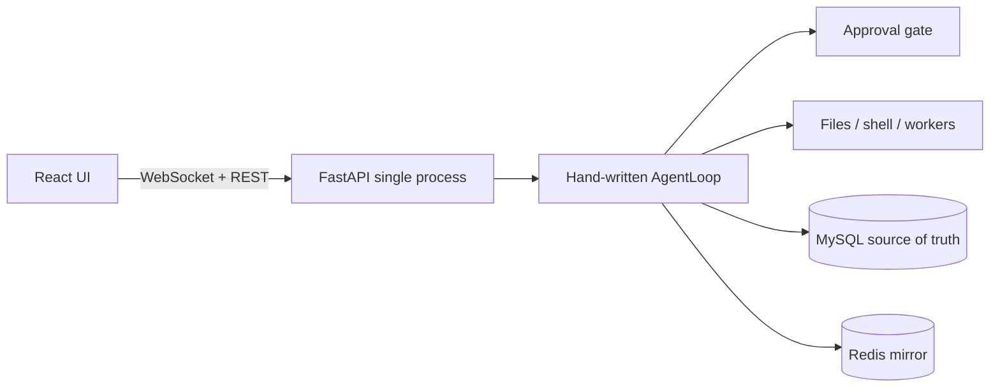

# Neharness

[中文](README.md) · English

[](https://github.com/nehc255646/Neharness/actions/workflows/ci.yml)
[](https://www.python.org/)
[](LICENSE)

A personal, single-machine, single-user web coding agent.

A hand-written asyncio loop streams thinking, text, and tool calls on three channels. Writes and shell commands go through an approval gate by default. The main agent can spawn background workers; you open an interactive sidebar sub-agent from the header. This is not a LangChain AgentExecutor wrapper, and it is not a multi-tenant product.

No auth, no rate limits. Binds to localhost by default. Do not expose this to the public internet.

---

## Stack

| Layer | Choice | Role |
|---|---|---|
| Agent runtime | Python 3.14 · hand-written asyncio loop · LangChain tool binding · OpenAI-compatible streaming | One `AgentLoop` per session: drain queue → sliding window / summary → model → **sequential** tool dispatch → atomic history fill |
| API | FastAPI · WebSocket + REST · uvicorn `--workers 1` | Chat, approvals, stop, and sub-agents over WS; providers / models / sessions over REST |
| Source of truth | MySQL 8 · SQLAlchemy asyncio · Alembic | Sessions, messages, tool logs, sub-agent runs, encrypted provider keys |
| Realtime mirror | Redis (in-memory fallback) | Agent state, in-flight approvals, session allow rules, summary cache. TTL expiry ≠ end of life |
| Frontend | React 18 · TypeScript · Vite · Tailwind · zustand | Timeline, tool cards, line-level diffs, three-way approval, sidebar, worker list |
| Safety | Fernet · per-session workspace · blacklist / allow rules | `api_key` encrypted at rest; files and shell locked to `WORKDIR/<session_id>/` |
| Engineering | uv · ruff · pytest · GitHub Actions | Backend unit + WS integration tests; frontend `tsc` + eslint |

The backend **must be a single process**. `AgentManager` and approval futures are in-process; extra workers break routing.

---

## Features

**A loop you can explain, not a framework you hide behind.** Streaming thinking (`reasoning_content` / `<think>`) is split from text and tool calls. Tools run in order so “allow similar this session” can apply to later shell calls in the same turn. Composer **Auto** can edit files and run commands; **Plan** binds read-only tools and produces a plan.

**The gate is a policy, not a modal.** Blacklist (segmented, including `rm -rf` variants) → `allow_rules.yaml` → session “allow similar” → otherwise a three-way prompt (once / similar / reject). Config allow requires **every** chained segment to match a prefix. Session-similar matches the **start of the whole command** (first two tokens when the rule is stored). Those two matchers are intentionally different.

**Two sub-agent kinds, deliberately asymmetric.** Interactive agents are user-opened only: no file or shell tools; a summary posts back to the main thread. Workers are spawned by the main agent: it must have used read/glob/grep first; each task must be a true subset of the user goal with a concrete `done_when`; wholesale subcontracting and fake splits are rejected. `spawn_*` blocks until the batch finishes and returns JSON as the tool result. Workers that finish after the main agent is `done` are marked `late` and fed back on the next hydrate.

**Storage layers you can defend in an interview.** MySQL is authoritative; Redis only mirrors realtime state. After a process restart: missing tool rows are synthesized, still-running interactive agents are restored, unfinished workers are marked interrupted. In-flight approval futures are not resumed — that recovery boundary is documented, not pretended away.

**Per-session workspace.** Each session gets a subdirectory; outbound symlinks and `../` do not escape. The shell subprocess does not inherit `ENCRYPTION_KEY`, `MYSQL_*`, or `*_API_KEY`.

**The UI is a control plane.** Streaming timeline, collapsed thinking, line-level diffs for write/edit, approval modal, session list, OpenAI-compatible providers (probe per model; optional `*_API_KEY` env).

---

## Architecture



If this ever scales out, pin `session_id` to a process. Do not promote Redis to source of truth.

---

## Design choices

- **Config allow vs session-similar:** see the gate above. `ls; rm -rf /` must not pass because `ls` is allowlisted; `echo hello && echo world` should pass after the user clicked “allow similar”.
- **Workers are not the main agent.** Their brief is “your only task”, not a copy of the main transcript. Overlapping files, restating the user’s request, or spawning before exploring are rejected.
- **Interactive agents are user-opened.** `spawn_subagent` from the main agent is refused. Closing the panel does not stop the agent.
- **Single process is a hard constraint.** Approvals hang on in-process futures. That is the current correct boundary, not a missing cluster.

---

## Quick start

```bash
cp .env.example .env
```

Fill in `MYSQL_USER` / `MYSQL_PASSWORD` / `MYSQL_DATABASE` (prefer `harness`, not root) and `ENCRYPTION_KEY`:

```bash
python -c "from cryptography.fernet import Fernet; print(Fernet.generate_key().decode())"
```

Boot refuses if providers exist and the key is missing. Create the database once:

```sql
CREATE DATABASE harness CHARACTER SET utf8mb4;
CREATE USER 'harness'@'localhost' IDENTIFIED BY '...';
GRANT ALL ON harness.* TO 'harness'@'localhost';
FLUSH PRIVILEGES;
```

No local MySQL / Redis:

```bash
docker compose up -d   # 3306 / 6379 on 127.0.0.1 only
./start.sh             # backend :8000 one worker + frontend :5173
```

From a host browser into a VM: `NEHARNESS_BIND=0.0.0.0 ./start.sh`, and add the origin to `CORS_ORIGINS`. Trusted LAN only.

Manual start:

```bash
cd backend && uv sync && uv run alembic upgrade head
uv run uvicorn app.main:app --host 127.0.0.1 --port 8000 --workers 1

cd frontend && npm install && npm run dev
```

Vite proxies `/api` and `/ws` to `:8000`. Open [http://127.0.0.1:5173](http://127.0.0.1:5173).

With no models configured, heuristic demo mode is used — try `执行 echo hello` / `run echo hello` to hit approval.

---

## Usage

1. Open **Models**, add an OpenAI-compatible `base_url` + `api_key` (or a `*_API_KEY` env var), then probe each model (failure does not block save).
2. Switch Auto / Plan in the composer; pick provider, then model. Changes apply on the next send.
3. Non-allowlisted `shell` / `write` / `edit`: **once** / **allow similar this session** / **reject**.
4. Open an interactive sidebar from the header; the main agent can spawn workers. Header **Stop** stops the main agent and its children.
5. Files and shell live in `WORKDIR/<session_id>/`. Persistent allow rules: `allow_rules.yaml`.

---

## Safety model

This is not a sandbox. The gate is for you, not an adversary.

- The blacklist splits on `;` `&&` `||` `|` plus destructive patterns such as `rm -rf`. It is not a semantic command analyzer.
- `read` / `write` / `edit` / `grep` do not follow symlinks out of the session workspace.
- `/api/llm/probe` only allows `http(s)`; env var names must end in `_API_KEY`.

---

## Configuration (excerpt)

| Variable | Default | Meaning |
|---|---|---|
| `WORKDIR` | `./workspace` | Workspace root; each session uses a subdirectory |
| `HOST` | `127.0.0.1` | Backend bind |
| `CORS_ORIGINS` | `http://localhost:5173,http://127.0.0.1:5173` | Browser Origin allowlist |
| `LLM_TIMEOUT` | `180` | Model request timeout (seconds) |
| `MAX_ROUNDS` | `50` | Max loop rounds per run |
| `WINDOW_N` | `20` | Sliding-window turns |
| `SUBAGENT_MAX_CONCURRENCY` | `3` | Shared sub-agent concurrency |
| `MAX_WORKERS_PER_TURN` | `2` | Workers spawned per turn |
| `APPROVAL_TIMEOUT` | `120` | Timed-out approvals are denied (seconds) |
| `WORKER_TIMEOUT` | `600` | Worker wall-clock timeout (seconds) |
| `BLACKLIST_ENABLED` | `true` | Destructive-command blacklist |
| `READONLY_NEED_APPROVAL` | `false` | Whether read-only tools need approval |
| `REDIS_URL` | `redis://localhost:6379/0` | Realtime store |

See `.env.example` for the full list.

---

## Development

```bash
cd backend && uv run ruff check app tests && uv run pytest
cd frontend && npx tsc --noEmit && npm run lint
```

CI: `.github/workflows/ci.yml`. API docs: `http://127.0.0.1:8000/docs`. Health: `GET /health`, `GET /api/health`.

Integration tests write `it_` / `ut_` sessions and `example.invalid` providers into MySQL; delete them when you are done.

---

## Known limits

- A process crash drops in-flight approval futures; mid-tool resume is out of scope
- Without Redis, reconnect is in-memory only
- No auth; do not expose this to the public internet

---

## License

[MIT](LICENSE)
