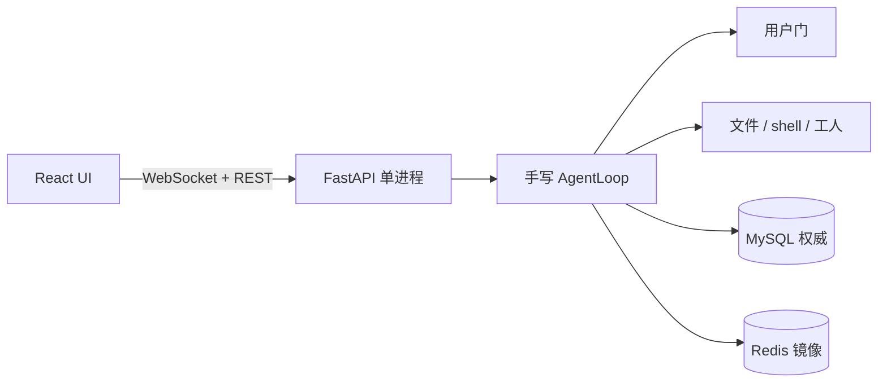

# Neharness

[English](README.en.md) · 中文

[](https://github.com/nehc255646/Neharness/actions/workflows/ci.yml)
[](https://www.python.org/)
[](LICENSE)

个人单机、单用户的 Web coding agent。

手写 asyncio 主循环，流式输出思考 / 正文 / 工具三通道；写入和 shell 默认过用户门；主对话可派后台工人，用户可从顶栏开交互型侧栏。不是 LangChain AgentExecutor 套壳，也不是多租户产品。

无鉴权、无限流。默认只绑本机。不要暴露到公网。

---

## 技术栈

| 层 | 选型 | 做什么 |
|---|---|---|
| Agent 运行时 | Python 3.14 · 手写 asyncio loop · LangChain 工具绑定 · OpenAI 兼容流 | 每会话一个 `AgentLoop`：drain 队列 → 滑窗/摘要 → 调模型 → **按序**分发工具 → 原子回填历史 |
| API | FastAPI · WebSocket + REST · uvicorn `--workers 1` | 对话、审批、停止、子 agent 全走 WS；Provider/Model/会话走 REST |
| 权威存储 | MySQL 8 · SQLAlchemy asyncio · Alembic | 会话、消息、工具日志、子 agent 运行、供应商密钥 |
| 实时镜像 | Redis（断线则内存降级） | agent 状态、进行中审批、会话放行规则、摘要缓存。TTL 过期 ≠ agent 结束 |
| 前端 | React 18 · TypeScript · Vite · Tailwind · zustand | 时间线、工具卡、行级 diff、审批三选、侧栏、工人列表 |
| 安全 | Fernet · 会话工作区 · 黑名单 / 放行规则 | `api_key` 落库加密；文件和 shell 锁在 `WORKDIR/<session_id>/` |
| 工程 | uv · ruff · pytest · GitHub Actions | 后端单测 + WS 集成；前端 `tsc` + eslint |

后端必须单进程。`AgentManager` 和审批 `Future` 是进程内注册表，多 worker 会把寻址和审批打乱。

---

## 功能特点

**手写主循环，而不是框架代跑。** 流式思考通道（`reasoning_content` / `<think>`）与正文、tool_calls 分路推到前端。工具按序执行，所以「本会话同类均执行」能作用到同一轮后续 shell。底栏 **Auto** 可改文件、跑命令；**Plan** 只绑定只读工具，产出计划。

**用户门是分级策略，不是弹窗装饰。** 黑名单拆段拒绝（含 `rm -rf` 的多种写法）→ `allow_rules.yaml` 配置放行 → 会话「同类均执行」→ 否则三选（一次 / 同类 / 拒绝）。配置放行要求链式命令**每一段**都命中前缀；会话同类按**整条命令开头**匹配（写入时取前 2 个 token）。两种匹配不能用同一套，否则「同类」几乎没用。

**两类子 agent，职责故意不对称。** 交互型只能由用户从顶栏打开，无文件/shell 工具，结束摘要回投主对话。工作型由主 agent 派：必须先自己 read/glob/grep，任务必须是总目标的真子集，每项带可验收的 `done_when`，禁止整单转包和假拆分。工人阻塞在 `spawn_*` 上，批次 JSON 作为工具结果返回。主 agent 已 `done` 才完成的工人标 `late`，下次 hydrate 再喂回。

**存储分层可讲清楚。** MySQL 是权威；Redis 只镜像实时态。进程重启后：补齐缺失的 tool 行、恢复仍在跑的交互型侧栏、未完成工人标中断。在途审批 Future 不续跑——恢复边界写在限制里，不装成精确 checkpoint。

**工作区按会话隔离。** 每个会话一个子目录，symlink / `../` 出不去。shell 子进程不继承 `ENCRYPTION_KEY`、`MYSQL_*`、`*_API_KEY`。

**前端是控制面。** 流式时间线、思考默认收起、write/edit 行级 diff、审批弹窗、会话列表、OpenAI 兼容供应商（可测连、可从 `*_API_KEY` 读密钥）。

---

## 架构



水平扩展若要做，应对 `session_id` sticky 到进程，而不是把 Redis 提升成权威。

---

## 设计决策

- **配置放行 vs 会话同类**：见上方用户门。`ls; rm -rf /` 不能因为 `ls` 在白名单里就整条放行；`echo hello && echo world` 在用户点过「同类」后应当放行。
- **工人不是主 agent**：brief 里只有「你的唯一任务」，不把主对话当可执行历史。重叠 files、复述用户原话、未调研就转包，一律拒绝。
- **交互型由用户打开**：主 agent 调用 `spawn_subagent` 只会得到拒绝。关侧栏 ≠ 停止。
- **单进程是硬约束**：审批挂在进程内 Future 上。这是当前正确的边界，不是漏做的集群。

---

## 快速开始

```bash
cp .env.example .env
```

至少填 `MYSQL_USER` / `MYSQL_PASSWORD` / `MYSQL_DATABASE`（建议都用 `harness`，不要用 root）和 `ENCRYPTION_KEY`：

```bash
python -c "from cryptography.fernet import Fernet; print(Fernet.generate_key().decode())"
```

已有供应商时缺密钥会拒绝启动。一次性建库：

```sql
CREATE DATABASE harness CHARACTER SET utf8mb4;
CREATE USER 'harness'@'localhost' IDENTIFIED BY '...';
GRANT ALL ON harness.* TO 'harness'@'localhost';
FLUSH PRIVILEGES;
```

没有本机 MySQL / Redis：

```bash
docker compose up -d   # 3306 / 6379 只绑 127.0.0.1
./start.sh             # 后端 :8000 单 worker + 前端 :5173
```

虚拟机要从宿主机访问：`NEHARNESS_BIND=0.0.0.0 ./start.sh`，并把 Origin 加进 `CORS_ORIGINS`。只在可信网络用。

手动启动：

```bash
cd backend && uv sync && uv run alembic upgrade head
uv run uvicorn app.main:app --host 127.0.0.1 --port 8000 --workers 1

cd frontend && npm install && npm run dev
```

Vite 把 `/api`、`/ws` 代理到 `:8000`。打开 [http://127.0.0.1:5173](http://127.0.0.1:5173)。

未配置模型时走 heuristic 演示：发「执行 echo hello」可打到审批。

---

## 使用

1. 「模型」里加 OpenAI 兼容的 `base_url` + `api_key`（或 `*_API_KEY`），按模型测连（失败仍可保存）。
2. 底栏切 Auto / Plan，先选供应商再选模型。下次发送生效。
3. 非放行的 `shell` / `write` / `edit`：**执行一次** / **本次会话同类均执行** / **拒绝**。
4. 顶栏打开交互型侧栏；主 agent 可派工人。顶栏「停止」停主 agent 及其子 agent。
5. 文件与 shell 在 `WORKDIR/<session_id>/`。持久放行见 `allow_rules.yaml`。

---

## 安全模型

这不是沙箱。门是给人用的，拦不住有意绕过。

- 黑名单按 `;` `&&` `||` `|` 拆段，外加 `rm -rf` 一类破坏性写法；不是命令语义分析。
- `read` / `write` / `edit` / `grep` 不跟随指向工作区外的 symlink。
- `/api/llm/probe` 只允许 `http(s)`，环境变量名须以 `_API_KEY` 结尾。

---

## 配置（节选）

| 变量 | 默认 | 说明 |
|---|---|---|
| `WORKDIR` | `./workspace` | 工作区根目录；每个会话一个子目录 |
| `HOST` | `127.0.0.1` | 后端绑定 |
| `CORS_ORIGINS` | `http://localhost:5173,http://127.0.0.1:5173` | 浏览器 Origin 白名单 |
| `LLM_TIMEOUT` | `180` | 模型请求超时（秒） |
| `MAX_ROUNDS` | `50` | 单 run 最大轮数 |
| `WINDOW_N` | `20` | 滑动窗口 turn 数 |
| `SUBAGENT_MAX_CONCURRENCY` | `3` | 子 agent 总并发 |
| `MAX_WORKERS_PER_TURN` | `2` | 单轮工作型上限 |
| `APPROVAL_TIMEOUT` | `120` | 审批超时默认拒绝（秒） |
| `WORKER_TIMEOUT` | `600` | 工作型整体超时（秒） |
| `BLACKLIST_ENABLED` | `true` | 破坏性命令黑名单 |
| `READONLY_NEED_APPROVAL` | `false` | 只读工具是否也要审批 |
| `REDIS_URL` | `redis://localhost:6379/0` | 实时层 |

完整列表见 `.env.example`。

---

## 开发

```bash
cd backend && uv run ruff check app tests && uv run pytest
cd frontend && npx tsc --noEmit && npm run lint
```

CI：`.github/workflows/ci.yml`。REST：`http://127.0.0.1:8000/docs`。健康检查：`GET /health`、`GET /api/health`。

集成测试会往 MySQL 写 `it_` / `ut_` 会话和 `example.invalid` 供应商，测完可删。

---

## 已知限制

- 进程崩溃丢掉在途审批 Future；不精确续跑工具中途
- 无 Redis 时断线恢复只靠内存
- 无鉴权；不要暴露到公网

---

## 许可证

[MIT](LICENSE)
